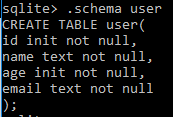

<h1>SQLite</h1>

<h1>Update</h1>

Es una herramienta de SQLite que se encarga de modificar un grupo de valores de una tabla que se encuentra en una base de datos especifica.

<h1>Schema</h1>

Es un conjunto de objetos creados dentro de la mismabase de datos para prganizar la información mediante tablas.

<h1>Date and time functions</h1>

Nos permite obtener la información de la fecha de documentos o local.

<h1>Primary key constraint</h1>

Debido a que las restricciones de clave principal nos garantizan datos únicos, con frecuencia se definen en una columna de identidad.

<h1>Not null constraint</h1>

Cuando crea una tabla , puede especificar si una columna acepta (NULL) valores o no. De forma predeterminada, todas las columnas de una tabla aceptan (NULL) valores, excepto que use (NOT NULL) restricciones explícitamente.

<h1>Unique constraint</h1>

Una (UNIQUE) restricción garantiza que todos los valores de una columna o un grupo de columnas sean distintos entre sí o únicos.

<h1>default constraint</h1>

La restricción predeterminada se usa para definir valores predeterminados para una columna en general.

<h1>Check constraint</h1>

La restricción (check) especifica los valores que acepta un campo, evitando que se ingresen valores inapropiados cuando ejecutamos un comando insert o update.

<h1>alter table</h1>

Permite al usuario renombrar una tabla o añadir una nueva columna a una tabla existente.

<h1>delete,drop</h1>

Elimina una tabla añadida mediante una sentencia CREATE TABLE.

<h1>backup,restored</h1>

Realizar copias de seguridad de archivos de base de datos mientras se ejecuta la aplicación.

